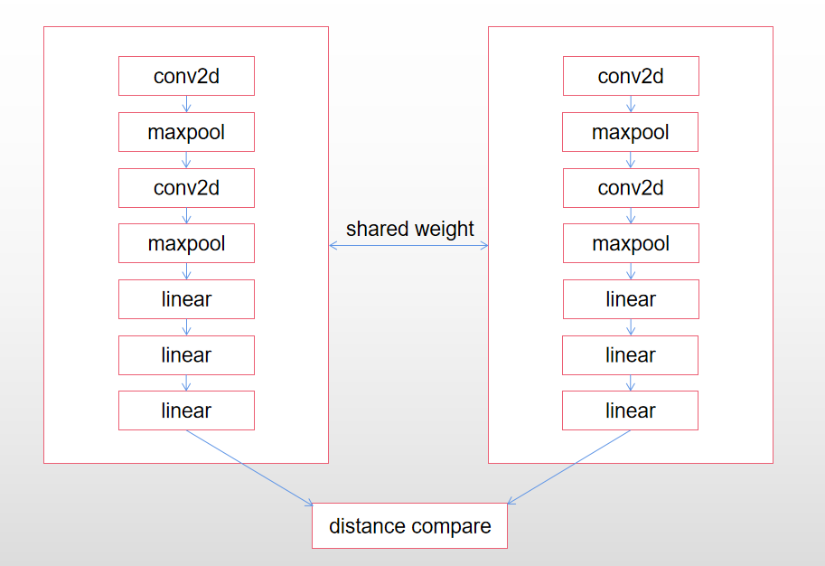
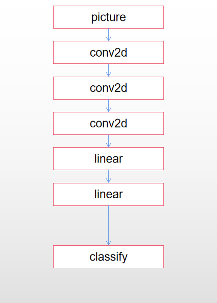
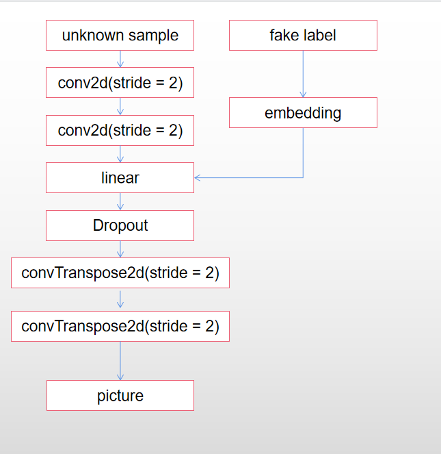
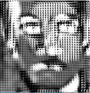
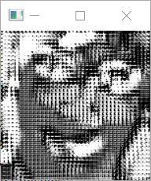
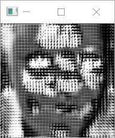
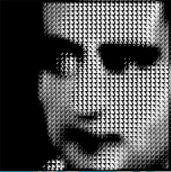
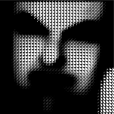
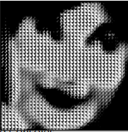

# Face recognition
### Requirements

Python 3.6.8, opencv-python 4.5.3.56, sklearn, face_recognition 1.3.0, skimage 0.17.2, matplotlib 3.3.4, dlib 19.6.1

shape_predictor_68_face_landmarks.dat needs to be downloaded and put under the current directory.

### Introduction

This project detect human face in dataset and classify the pictures into masked faces and unmasked faces. Furthermore, use face_recognition package and k neighbor algorithm for face recognition (judging whether the human face has been recorded in the known pictures and judging the owner of the picture).

### Implementation

There are 50 pictures in the dataset. picture_preprocess.ipynb is used for modifying pictures: convert to gray scale, crop the part with human faces and add mask on these human faces. The pre-processed faces are stored in unmaskedSet and maskSet directory respectively.

startert.ipynb is used for classifying masked or unmasked faces and for face recognition. For classifying, extract hog feature and classify with k neighbor algorithm. Then, I use compare_faces method in face recognition package and use k neighbor algorithm for face recognition respectively. The results of compare_faces method and k neighbor algorithm are shown in their corresponding part respectively.

change the `unmaskedSet`string for directory in codes into `maskSet` string can change the dataset from masked faces into unmasked faces dataset.

- key parameters in startert.ipynb:

- `known_tolerance`: Used for judging whether the picture is for any recorded human face. For compare_faces method, it represents the tolerance for error. Lower tolerance means stricter judgment. For k neighbor algorithm, it represents the distance threshold. If the distance of the two pictures is lower than the threshold, it means these two pictures are similar. Otherwise, they are not.

- `known_threshold`: Used for judging whether the test picture can be recognized as a known picture. For two methods, it represents the ratio of the total number of a person's pictures divided by the matched pictures for the test picture. The reason for setting this parameter is because for some pictures, it may coincidentally match the test picture for possible similarities. In order to reduce the influence of such possible errors, set this parameter which means that it allows the test picture mismatching a little number of the recorded pictures coincidentally.

### Result

For classifying masked and unmasked faces, its about 1.0 accuracy with k neighbor algorithm.

For both method in face recognition, with `know_tolerance = 0.4` and `known_threshold = 0.1`, the accuracy is about 0.83, frr is about 0.2, far is about 0.08 for unmasked faces dataset. the accuracy is about 0.79, frr is about 0.1, far is about 0.12 for masked faces fataset.

### Further Development

Use Siamese network for face recognition. Compare the test picture with known pictures to calculate average distance. If the minimum distance is larger than 0.6, then it will be classified into unknown person. Otherwise, choose the person with minimum distance as the recognized person.

### Result

With epoch = 50 and batch_size = 30, the face recognition accuracy can reach 0.75. frr is about 0.14 and far is about 0.24. Larger epoch may enable for better result.

### Use GAN for face recognition

Try to use GAN for face recognition, but the result accuracy is really bad. Even though I have changed the learning rate, modified the batch size and adjusted net framework, the loss of discriminator decrease too fast and the generator's loss keeps high. frr and far are really high. It may need better framework.

discriminator:

generator (fake label may be 1,2,3,...,10):

The result of classification is not good. This model needs better improvement.

Generator result:

  

### Use GAN + CNN for face recognition

Change the framework to let GAN for recognizing whether the person is known and if recorded, use CNN for recognizing recorded person. The accuracy is not good for GAN. For CNN, accuracy for train set is about 0.87 and accuracy for test set is about 0.63. The reason for GAN bad performance may be the low quality of generated pictures. Then the discriminator cannot extract the special feature for known person.

Generator result:

  
